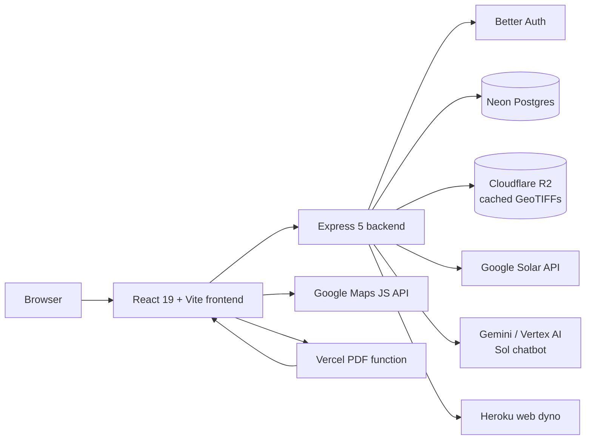
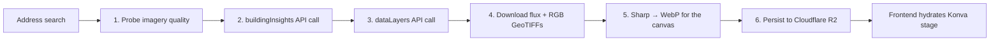
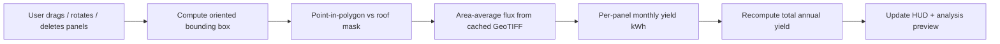
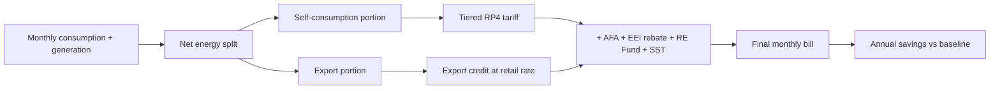

```mermaid
flowchart LR
    User[User opens Sol panel] --> Composer[Composer + cooldown gate]
    Composer --> Post[POST /api/projects/:id/chat]
    Post --> Auth[Better Auth session]
    Auth --> Guard[Prompt-injection + length guard]
    Guard --> Project[(Load Project + Location<br/>from Postgres)]
    Project --> Digest[Render page-aware digest<br/>workbench or analysis]
    Digest --> Bible[Load knowledge bible<br/>Malaysian solar primer]
    Bible --> Prompt[Build layered system prompt<br/>language · persona · rules · primer · digest]
    Prompt --> Client[GenAI client<br/>Vertex AI → API-key fallback]
    Client --> Gemini[Gemini streamGenerateContent]
    Gemini --> SSE[SSE token stream]
    SSE --> Frontend[Stream + render markdown]
    Frontend --> Chips[Sample follow-up chips<br/>from chat.json pool]
    Frontend -.client disconnect.-> Abort[AbortController cancels Gemini call]
```

<div align="center">


# SolarSim

### Rooftop solar in three steps, grounded in real Malaysian tariffs.

_Search a roof. Tweak the layout. Get a NEM-accurate savings report. As easy as **A-B-C**._

<br/>

<p>
  
  
  
  
  
  
  
  
  
  
  
</p>

<p><strong>Aligned with the UN Sustainable Development Goals</strong></p>

<p>
  
</p>

<br/>


</div>

---

> Built by **[@AlaskanTuna](https://github.com/AlaskanTuna)**.

> [!NOTE]
> SolarSim is an **assessment** tool. It produces an estimate report, not a quotation, not a contract, and not an installation order. Final pricing and feasibility always come from a licensed Malaysian installer.

> [!WARNING]
> **The live deployment is currently offline.** The database has moved to Neon; the remaining hosting cutover for `solarsim.tech` is still in progress. Everything below describes the product — clone it and run the local quickstart to see it working. Progress is tracked in the [v1.1 — Back Online](https://github.com/AlaskanTuna/SolarSim/milestone/1) milestone.

## Walkthrough

https://github.com/AlaskanTuna/SolarSim/releases/download/v1.1-walkthrough/solarsim-walkthrough.mp4

The three-page flow: **Map** (search a roof, one Solar API call, cached forever) → **Workbench** (drag, rotate, and delete panels on a Konva canvas, with flux resampled locally) → **Analysis** (NEM Rakyat 3.0 billing simulation and PDF export).

---

## ✨ At a Glance

<table>
  <tr>
    <td align="center"><strong>3 pages</strong><br/><sub>Map → Workbench → Analysis, end to end</sub></td>
    <td align="center"><strong>~90s</strong><br/><sub>average time from address to first savings projection</sub></td>
    <td align="center"><strong>RP4 + EEI + AFA + RE Fund</strong><br/><sub>full TNB tariff stack post-July 2025</sub></td>
  </tr>
</table>

---

## 🖼 Screenshots

<table>
  <tr>
    <td width="33%"><p align="center"><sub><strong>Landing.</strong> <em>Marketing site, pricing, and FAQ.</em></sub></p></td>
    <td width="33%"><p align="center"><sub><strong>Dashboard.</strong> <em>Greeting, quick actions, and recent projects.</em></sub></p></td>
    <td width="33%"><p align="center"><sub><strong>Projects.</strong> <em>Saved projects with status and workflow guide.</em></sub></p></td>
  </tr>
  <tr>
    <td width="33%"><p align="center"><sub><strong>Map.</strong> <em>Search any Malaysian address and lock in the rooftop.</em></sub></p></td>
    <td width="33%"><p align="center"><sub><strong>Workbench.</strong> <em>Drag, rotate, and shape the panel layout.</em></sub></p></td>
    <td width="33%"><p align="center"><sub><strong>Analysis.</strong> <em>NEM bill simulation, payback, and PDF export.</em></sub></p></td>
  </tr>
</table>

---

## 🧠 What SolarSim Does

### The Problem

Malaysian homeowners interested in rooftop solar have limited access to quick, data-driven preliminary assessments. Existing options are either manual on-site surveys (expensive and slow) or generic online calculators that lack roof-specific data. There is no tool that lets users see a proposed panel layout on _their actual rooftop_, interactively adjust it, and immediately understand the financial impact under Malaysia's NEM Rakyat 3.0 scheme.

### Project Objectives

1. **Investigate** rooftop characteristics and solar energy potential using Google Solar API's geospatial data as a basis for reducing reliance on manual assessments.
2. **Design and develop** a web-based tool that auto-generates preliminary panel layouts, enables interactive modification, and incorporates Malaysian tariff and NEM parameters.
3. **Evaluate** the system's usability, accuracy, and effectiveness through user feedback and comparison with existing methods.

### Target Users

| User Type     | Description                                                                    |
| ------------- | ------------------------------------------------------------------------------ |
| **Primary**   | Malaysian homeowners exploring rooftop solar installation                      |
| **Secondary** | Solar installers using the tool for quick preliminary assessments with clients |

User assumptions: non-technical, unfamiliar with solar terminology, accessing via desktop browser (primary) or mobile browser (secondary).

---

## 🏗 Feature Matrix

|     | Feature                       | What it means                                                                                                                                                 |
| --- | ----------------------------- | ------------------------------------------------------------------------------------------------------------------------------------------------------------- |
| 🛰  | **Solar API Pipeline**        | One Solar API call per address, results cached forever. Building insights, monthly flux, and DSM/RGB GeoTIFFs are persisted in private Cloudflare R2 storage. |
| 🖼  | **GeoTIFF Re-sampling**       | Panel moves never re-hit the Solar API. Flux is re-sampled locally from the cached GeoTIFF using point-in-polygon over each panel's rotated OBB.              |
| 🎨  | **Konva Canvas Workbench**    | React-Konva stage with pan, zoom, marquee select, free-rotate, snap-align, undo/redo, and an irradiance-direction amber glow for the chosen month.            |
| 💡  | **Roof-Aware Layout Presets** | Tell SolarSim your monthly bill and savings goal; it right-sizes panel count and orientation. Skippable, so power users get the maximum-coverage view.        |
| 💰  | **NEM Rakyat 3.0 Engine**     | Self-consumption + export simulation, EEI banding, AFA monthly variation, SST and RE Fund. Implemented as a typed billing engine with 36 unit tests.          |
| 📈  | **Lifecycle Mode**            | Switch from simple payback to a 25-year lifecycle view: degradation, tariff escalation, scheduled inverter swaps, and annual maintenance.                     |
| 🌐  | **i18n (EN / MS / ZH)**       | Three fully-translated locales including all tariff explainers, with locale-aware Intl number/date formatting (`zh-Hans-MY` for the demo audience).           |
| 🎭  | **Theme + A11y**              | Light / dark / system theme persisted via `next-themes`, glassmorphic UI primitives, full keyboard support on the canvas, and visible focus rings.            |
| 📄  | **Sandboxed PDF Export**      | Heroku backend signs a 60-second token; a separate Vercel function navigates a headless Chromium to a print route and ships the A4 landscape PDF.             |
| 🔐  | **Better Auth**               | Self-hosted email/password and Google OAuth, with per-user quota enforcement and remember-email on sign-in.                                                   |
| 💬  | **Sol Chatbot Assistant**     | Project-aware chat grounded in your project's data and a curated solar knowledge bible. Streams over SSE, page-aware, EN/MS/ZH, prompt-injection guarded.     |

---

## 🌏 Why It Matters: SDG Alignment

SolarSim is built around one product stance: **Malaysian homeowners should be able to make a data-driven solar decision without first surrendering their phone number to an installer.** That stance maps directly to one UN Sustainable Development Goal:

| SDG                                                                    | Goal                            | How SolarSim contributes                                                                                                                                                                         |
| ---------------------------------------------------------------------- | ------------------------------- | ------------------------------------------------------------------------------------------------------------------------------------------------------------------------------------------------ |
|  | **Affordable and Clean Energy** | Lowering the friction between curiosity and a real solar quotation accelerates household adoption. Every projection cites tariff schedules so the upside number is verifiable, not sales-pitchy. |

---

## 🏛 Architecture

SolarSim is a three-tier monorepo: a **React 19 + Vite SPA**, an **Express 5 + Prisma backend**, and a **Vercel Puppeteer microservice** for PDF rendering. Better Auth runs inside Express, Neon provides Postgres, and Cloudflare R2 stores cached GeoTIFFs.



<details>
<summary><strong>Solar Pipeline: Address to Editable Roof</strong></summary>



</details>

<details>
<summary><strong>Workbench Edit Loop: Zero Solar API Calls</strong></summary>



</details>

<details>
<summary><strong>NEM Billing Engine: Per-Month Bill Comparison</strong></summary>



</details>

<details>
<summary><strong>Sol Chatbot: Project-Grounded SSE Pipeline</strong></summary>



</details>

---

## 🧰 Tech Stack

| Category        | Technology                                                                   | Notes                                                           |
| --------------- | ---------------------------------------------------------------------------- | --------------------------------------------------------------- |
| Frontend        | React 19 · Vite 6 · TypeScript 5 · Tailwind CSS 4 · shadcn/ui · lucide-react | SPA with React Router, TanStack Query, framer-motion            |
| Canvas & 3D     | Konva 9 · react-konva · @react-three/fiber · @react-three/drei               | Workbench stage, snap alignment, panel-model 3D preview         |
| Charts & DnD    | Recharts 3 · @dnd-kit/core · @dnd-kit/sortable                               | Analysis charts, sortable hero card layout                      |
| i18n & Theming  | i18next · react-i18next · next-themes                                        | en / ms / zh, light / dark / system theme                       |
| Backend         | Express 5 · TypeScript 5 · Prisma 6 · Zod                                    | REST API, validators, Better Auth                               |
| Geo & Imagery   | geotiff.js · sharp · proj4                                                   | GeoTIFF parsing, raster → WebP, lat-lng ↔ pixel reprojection    |
| Identity & Data | Better Auth · Neon Postgres · Cloudflare R2                                  | Email/password + Google OAuth, API-authorized per-user projects |
| External APIs   | Google Solar API · Google Maps JavaScript API · Geocoding API                | One Solar call per address, cached forever                      |
| Chat & GenAI    | @google/genai (Gemini / Vertex AI) · SSE-over-POST streaming                 | Sol assistant with project-grounded prompts, dual-auth fallback |
| Testing         | Vitest · @testing-library/react · jsdom                                      | Co-located unit tests, 407 passing                              |
| PDF Service     | Vercel function · Puppeteer · Chromium (headless)                            | Sandboxed off the Heroku dyno, signed-token access              |
| Deploy          | Heroku (web dyno) · Vercel (PDF function) · GitHub Actions CI/CD             | `pnpm` build on Heroku via `heroku-postbuild`                   |

---

## 🚀 Getting Started

> [!TIP]
> **Looking to reproduce the full stack from scratch — local dev _and_ cloud deploy?**  
> See **[RUNBOOK.md](RUNBOOK.md)** for the complete clone-to-production walkthrough: cloud account setup, CLI provisioning, env wiring, Heroku + Vercel deploy, custom domain, smoke tests, and troubleshooting. ~60-90 min on a fresh machine.
>
> The section below is the **5-minute local quickstart** — enough to boot SolarSim against an existing Neon + Cloudflare R2 + Google Cloud + Resend setup. If you don't have those yet, jump to RUNBOOK.md instead.

### Local Quickstart (Existing Cloud Setup)

```bash
# 1. Install local toolchain
corepack enable                                   # bundles pnpm 10.33.3 with Node 24

# 2. Clone and install
git clone https://github.com/AlaskanTuna/SolarSim.git
cd SolarSim
pnpm install

# 3. Configure env (fill in values from your existing cloud accounts)
cp .env.example .env
# edit .env — see RUNBOOK.md §4 for what each variable means

# 4. Initialise the database and run
pnpm prisma:generate
pnpm db:migrate
pnpm db:seed
pnpm dev                                          # frontend :5173 + backend :3001
```

Visit `http://localhost:5173` → sign up → click the confirmation email → you're in.

### Prerequisites

- **Node.js** `24.x` — [nodejs.org](https://nodejs.org)
- **pnpm** `10.33.3` (via `corepack enable` — ships with Node 24)
- **git**
- A Neon project, private Cloudflare R2 bucket, Google Cloud project (Solar + Maps + Geocoding APIs enabled), and Resend account. New to these services? Use **[RUNBOOK.md](RUNBOOK.md)** to provision them.

### Useful Commands

| Command                  | Description                                                         |
| ------------------------ | ------------------------------------------------------------------- |
| `pnpm dev`               | Start frontend + backend concurrently                               |
| `pnpm dev:backend`       | Start backend only                                                  |
| `pnpm dev:frontend`      | Start frontend only                                                 |
| `pnpm build`             | Build all workspaces for production                                 |
| `pnpm test`              | Run frontend + backend unit tests                                   |
| `pnpm typecheck`         | Strict TS check across every package                                |
| `pnpm format`            | Run Prettier across the repo                                        |
| `pnpm prisma:generate`   | Regenerate the Prisma client (after `schema.prisma` edits)          |
| `pnpm db:migrate`        | Apply migrations interactively (local dev)                          |
| `pnpm db:migrate:deploy` | Apply migrations non-interactively (Heroku release, CI, recovery)   |
| `pnpm db:seed`           | Seed tariff config data                                             |
| `docker compose up -d`   | Run the backend + a local Postgres in containers (see RUNBOOK §2.1) |

---

## ☁ Deployment

The production stack is **two services**: a Heroku web dyno (frontend bundle + Express API) and a separate Vercel function for PDF rendering, fronted by a custom domain (`solarsim.tech`) with HTTPS via Heroku ACM.

> [!TIP]
> The full deploy walkthrough — `heroku create`, every config var, custom domain attachment, Vercel link, CI/CD secrets, and post-deploy smoke tests — lives in **[RUNBOOK.md §6-§9](RUNBOOK.md)**. It's the canonical guide; this section is a one-screen reference for maintainers who already deployed once and just need a refresher.

**Deployment Architecture:**

- Frontend + API: <https://solarsim.tech> (Heroku dyno behind custom domain)
- PDF render function: Vercel Hobby tier (URL set via `PDF_EXPORT_URL`)
- CI/CD: `.github/workflows/ci-cd.yml` — PRs run tests, pushes to `main` deploy to Heroku
- Database migrations: auto-applied via Heroku's `release:` phase in `Procfile` (`pnpm db:migrate:deploy`)
- Email delivery: Resend HTTP API from the Express backend, sender `noreply@solarsim.tech`

**Required GitHub repo secrets** (set via `gh secret set <name>`):

- `HEROKU_API_KEY` — `heroku auth:token`
- `HEROKU_APP_NAME` — the Heroku app slug

> [!IMPORTANT]
> If the live URLs or commands drift, the `Procfile`, `heroku-postbuild` script in `package.json`, and `.github/workflows/ci-cd.yml` are the source of truth, not this README.

---

## 🔒 Disclaimers

> [!CAUTION]
> All figures in SolarSim are **estimates** based on satellite-derived flux data. Real-world generation and savings can differ by 10 to 15 percent or more depending on shading, soiling, inverter behaviour, and weather variance not captured in the input data.

- 🧾 **Tariff Provenance.** Every kWh figure traces back to gazetted Suruhanjaya Tenaga and TNB schedules. RP4 brackets, EEI bands, AFA, SST, and the RE Fund are seeded as typed config, not narrated by an LLM.
- 🛰 **Imagery Scope.** Rooftop imagery and flux rasters come exclusively from the Google Solar API and stay scoped to the user's project. SolarSim does not scrape, syndicate, or republish any third-party data.
- ⚖ **Layout Boundary.** The Workbench plans where panels could go, not whether they should. Purlin spacing, MCB sizing, inverter placement, and roof-load calculations are out of scope and remain the installer's responsibility.
- 🔑 **Data Ownership.** Every API request is authorized against the Better Auth session, and Prisma queries are scoped to that user. Account deletion cascades and removes the user's projects, cached imagery, and saved analyses.
- 🛡 **PDF Token Security.** PDF exports use signed tokens that expire in 60 seconds and are scoped to a single project, so leaked URLs cannot be replayed by anyone else.

---

## 🧭 Known Limitations

- **Panel placement is approximate.** The Google Solar API derives suggested panel positions from flux heuristics, not true roof-edge segmentation, so a layout occasionally doesn't align cleanly with the actual roof. This is a permanent trade-off rather than an open bug — closing the gap properly would take ML-based roof segmentation or constrained re-optimisation against the roof mask, both research-grade efforts outside this project's scope. The Workbench's drag-and-snap editing exists precisely for this: move a panel and it snaps flush against its neighbours.
- **Solar API coverage is uneven across Malaysia.** Some addresses, including parts of the Klang Valley, have thin or missing `HIGH`-quality imagery. SolarSim probes for the best available quality before committing to a location and falls back to `BASE` imagery with expanded coverage where possible, surfaced in the UI as an amber "Imagery: BASE" badge — lower-resolution imagery means less precise flux sampling and panel placement.
- **NEM billing is an estimate, not a utility quote.** The billing engine simulates NEM Rakyat 3.0 self-consumption and export against seeded TNB RP4 tariffs (with EEI, AFA, SST, and RE Fund adjustments). Multi-year Lifecycle projections apply a configurable tariff escalation rate that defaults to 0% — future TNB rate revisions aren't predicted, only modelled if you choose to set one.
- **Mobile and touch testing is deferred.** The Konva canvas, sidebar, and panel drawer have been verified on desktop and browser devtools emulation, not on real mobile devices. Tracked as an open item.

---

## 👤 Developer

<table align="center">
  <tr>
    <td align="center" width="220">
      <a href="https://github.com/AlaskanTuna"></a><br/>
      <strong>Adam</strong><br/>
      <a href="https://github.com/AlaskanTuna"><sub>@AlaskanTuna</sub></a><br/>
    </td>
  </tr>
</table>

---

## 📁 Project Structure

<details>
<summary><strong>Repository Layout</strong></summary>

```text
SolarSim/
├── assets/                     # README screenshots and brand art
├── shared/                     # Shared TypeScript types (consumed by both sides)
├── frontend/                   # React 19 + Vite SPA
│   ├── public/                 #   Logos, landing hero, dashboard art, favicons
│   └── src/
│       ├── api/                #   Typed REST client (locations, projects, quota, tariff)
│       ├── components/         #   shadcn/ui, layout, workbench, analysis, pdf, dashboard
│       ├── hooks/              #   React hooks (auth, panels, workbench data, undo/redo)
│       ├── lib/                #   Billing engine, canvas transforms, snap-alignment, i18n
│       ├── locales/            #   en / ms / zh translation namespaces
│       └── pages/              #   Route page components (3-page MVP + dashboard suite)
├── backend/                    # Express 5 + Prisma API
│   └── src/
│       ├── config/             #   Env, Prisma, Better Auth, and R2 clients
│       ├── geo/                #   Coordinate transforms, flux sampler, OBB geometry
│       ├── middleware/         #   Auth, validation, rate-limit, error handler
│       ├── routes/             #   /locations, /projects, /tariff, /quota, /chat, /health
│       ├── services/           #   Solar API pipeline, location service, chat, PDF token signer
│       └── app.ts              #   Express app composition
├── services/
│   └── pdf-service/            # Standalone Vercel + Puppeteer PDF function
├── prisma/
│   ├── schema.prisma           # Postgres schema (User/Session/Account, Location, Project, TariffConfig)
│   └── seed.ts                 # Seeds RP4 + EEI + AFA + RE Fund tariff defaults
├── .github/workflows/          # ci-cd.yml: CI + Heroku auto-deploy
├── Dockerfile                  # Multi-stage container build (see RUNBOOK section 2.1)
├── docker-compose.yml          # Backend + local Postgres 17 for offline development
├── package.json                # Root workspace orchestrator
├── pnpm-workspace.yaml
└── .env.example
```

</details>

### Documentation Hygiene

`graphify-out/graph.json` and `graphify-out/GRAPH_REPORT.md` are a generated knowledge graph of this codebase, committed so contributors don't have to rebuild it — do not hand-edit them. Refresh after code changes with `graphify update .` (code-only, no LLM, free). A change that deletes a lot of source can trip its shrink guard; re-run with `--force` if that happens.

---

<div align="center">

<sub><strong>SolarSim</strong> · © 2026 Adam ([@AlaskanTuna](https://github.com/AlaskanTuna))</sub>

</div>
